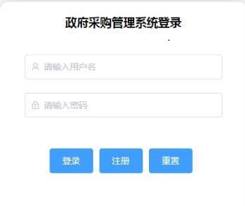
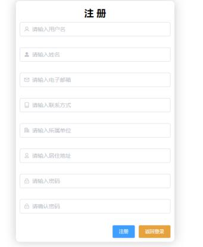
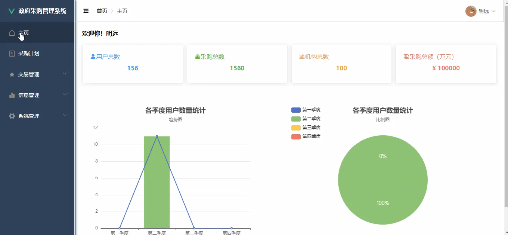
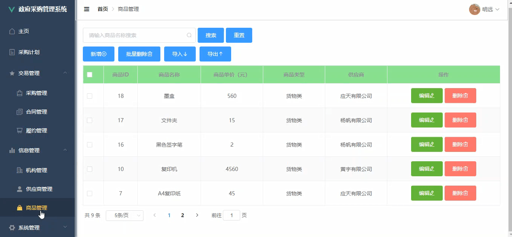

# purchasing-manage
## 基于 SpringBoot + Vue 的政府采购管理系统项目
### 1.运行环境
JDK1.8、Maven、Mysql、IntelliJ IDEA
### 2.使用教程
①　启动前自行导入mysql文件夹中数据库脚本到数据库中。
②　导入数据库成功后，配置 “application.yml”中相关 “mysql”
③　配置完成，运行`Application`中的 `main `方法;运行 npm run serve。
④　输入网址：http://localhost:8080；测试账号：admin101 密码：123456。
### 3.内置功能及演示图
该管理系统主要由以下三种身份构成：超级管理员、单位管理员、供应商；主要实现了三大方面：采购预算管理，采购交易管理以及采购信息管理。
#### 3.1 登录/注册

#### 3.2 主页
实时展示系统相关信息

#### 3.5 采购计划

#### 3.4 采购管理

#### 3.5 商品管理
对商品进行增删改查，可以导入导入

#### 3.6 文件管理

#### 3.7 合同管理
增删改查，可上传合同文件

#### 3.8 个人信息管理

#### 3.9 角色/菜单管理

